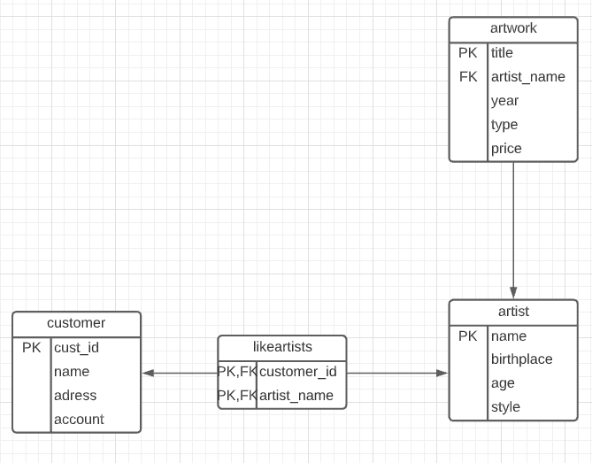

# CSI 2532 - Lab 06

Student name and number

<br />

| **Name** | **Student Number** |
| ---| --- |
| christian tchoutang | 300101550 |

<br />

## Objectifs

<br />

‣ Réexaminer CREATE, INSERT, SELECT, UPDATE, DELETE

‣ Modification des bases de données avec ALTER TABLE

‣ Pratiquer à écrire des requêtes SQL

<br />

### TRANSFORMEZ ER EN SCHÉMA RELATIONNEL

<br />



<br />

## CRÉER VOTRE BASE DE DONNÉES

<br />

```sql
CREATE TABLE artists (  
    name VARCHAR(20),  
    birthplace VARCHAR(20),
    style VARCHAR(20),
    dateofbirth DATE,
    PRIMARY KEY (name));

CREATE TABLE customers (
    id INTEGER, 
    name VARCHAR(20),
    address VARCHAR(20),
    amount numeric(8,2),
   PRIMARY KEY (id)
   );
   
CREATE TABLE artworks (
    title VARCHAR(20),
    year INTEGER,
    type VARCHAR(20),
    price numeric(8,2),
    artist_name VARCHAR(20),
    PRIMARY KEY (title),
    FOREIGN KEY(artist_name) REFERENCES artists(name)
    );
                  
    CREATE TABLE likeartists ( 
        customer_id INTEGER,
        artist_name VARCHAR(20),
        PRIMARY KEY(artist_name, customer_id),
        FOREIGN KEY (artist_name) REFERENCES artists(name),  FOREIGN KEY (customer_id) REFERENCES customers(id)
        );

  ```

  <br />

## AJOUTEZ DES DONNÉES À VOTRE BASE DE DONNÉES

<br />

  ```sql
  INSERT INTO customers
(id, name, address, amount)
VALUES
(1, 'John', 'Ottawa', 8.5),
(2, 'Amy', 'Orleans', 9.0),
(3, 'Peter', 'Gatineau', 6.3);

INSERT INTO artists
(name, birthplace, style, dateofbirth)
VALUES
('Caravaggio', 'Milan', 'Baroque', '1571-09-28' ),
('Smith', 'Ottawa', 'Modern', '1977-12-12'),
('Picasso', 'Malaga', 'Cubism', '1881-10-25');

INSERT INTO artworks
(title, year, type, price, artist_name)
VALUES
('Blue', 2000, 'Modern', 10000.00, 'Smith'),
('The Cardsharps', 1594, 'Baroque', 40000.00, 'Caravaggio');
  ```

<br />


## LISTE TOUS LES ARTISTES NÉS À OTTAWA

<br />

```sql 
SELECT *
FROM artists
WHERE birthplace = 'Ottawa';
```

<br />

 name  | birthplace | style  | dateofbirth
-------|------------|--------|-------------
 Smith | Ottawa     | Modern | 1977-12-12

<br />

## LISTE DES TITRES ET DES PRIX DE TOUTES LES OUVRAGES D'ART EN 2000.

<br />

```sql
SELECT title, price
FROM artworks
WHERE year = 2000;
```

<br />

 title |  price
-------|----------
 Blue  | 10000.00

<br />

## METTRE À JOUR LE MONTANT POUR TOUS LES CLIENTS DE GATINEAU À 9.8.

<br />

```sql
UPDATE customers
SET amount = 9.8
WHERE address = 'Gatineau';
```

<br />

 id | name  | address  | amount
----|-------|----------|--------
  1 | John  | Ottawa   |   8.50
  2 | Amy   | Orleans  |   9.00
  3 | Peter | Gatineau |   9.80

<br />

## Université d'Ottawa University of Ottawa 9 SUPPRIMER LE CLIENT JOHN.

<br />

```sql
DELETE
FROM customers
WHERE name = 'John';
```

<br />

 id | name  | address  | amount
----|-------|----------|--------
  2 | Amy   | Orleans  |   9.00
  3 | Peter | Gatineau |   9.80

<br />

## Université d'Ottawa University of Ottawa AJOUTER LA COLONNE COUNTRY À ARTISTS.

<br />

```sql 
ALTER TABLE artists
ADD COLUMN country varchar(100);
```

<br />


name    | birthplace |  style  | dateofbirth | country
------------|------------|---------|-------------|---------
 Caravaggio | Milan      | Baroque | 1571-09-28  |
 Smith      | Ottawa     | Modern  | 1977-12-12  |
 Picasso    | Malaga     | Cubism  | 1881-10-25  |

<br />

## AJOUTEZ UNE COLONNE RATING À CUSTOMERS, AVEC LA CONTRAINTE: LA VALEUR DOIT ÊTRE ENTRE 1 ET 10.


<br />

```sql
ALTER TABLE customers
ADD COLUMN rating integer CHECK (rating between 1 and 10);
```

<br />

 id | name  | address  | amount | rating
----|-------|----------|--------|--------
  2 | Amy   | Orleans  |   9.00 |
  3 | Peter | Gatineau |   9.80 |

<br />

## AJOUTEZ (ENCORE) DES DONNÉES À VOTRE BASE DE DONNÉES

<br />

```sql
INSERT INTO artworks
(title, year, type, price, artist_name)
VALUES
('Blue', 2000, 'Modern', 10000.00, 'Smith'),
('The Cardsharps', 1594, 'Baroque', 40000.00, 'Caravaggio');

INSERT INTO customers
(id, name, address, amount, rating)
VALUES
(4, 'Emre', 'Preston', 20000.00, 5),
(5, 'Saeid', null, 40000.00, 6);

INSERT INTO artists
(name, birthplace, style, dateofbirth, country)
VALUES
('Leonardo', 'Florence', 'Renaissance', '04-15-1452', 'Italy'),
('Michelangelo', 'Arezzo', 'Renaissance', '03-06-1475',
'Italy'),
('Josefa', 'Seville', 'Baroque', '09-09-1630', 'Spain'),
('Hans Hofmann', 'Weisenburg', 'Modern', '02-17-1966', 'Germany'),
('John', 'San Francisco', 'Modern', '02-17-1920', 'USA');

INSERT INTO artworks
(title, year, type, price, artist_name)
VALUES
('Waves', 2000, null, 4000.00, 'Smith'),
('Three Musicians', 1921, 'Modern', 11000.00, 'Picasso');

INSERT INTO likeartists
(customer_id, artist_name)
VALUES
(4, 'Picasso'),
(5, 'Picasso'),
(5, 'Leonardo');
```

<br />

## SUPPRIMEZ L'ARTISTE SMITH

<br />

### Supprimez toutes les oeuvres d'art liées à Smith.

<br />

```sql
DELETE
FROM artworks
WHERE artist_name = 'Smith';
```

<br />

title      | year |  type   |  price   | artist_name
-----------------|------|---------|----------|-------------
 The Cardsharps  | 1594 | Baroque | 40000.00 | Caravaggio
 Three Musicians | 1921 | Modern  | 11000.00 | Picasso

<br />

### Supprimez ensuite Smith de la liste des artistes.

<br />

```sql 
DELETE
FROM artists
WHERE name = 'Smith';
```

<br />

name     |  birthplace   |    style    | dateofbirth | country
--------------|---------------|-------------|-------------|---------
 Caravaggio   | Milan         | Baroque     | 1571-09-28  |
 Picasso      | Malaga        | Cubism      | 1881-10-25  |
 Leonardo     | Florence      | Renaissance | 1452-04-15  | Italy
 Michelangelo | Arezzo        | Renaissance | 1475-03-06  | Italy
 Josefa       | Seville       | Baroque     | 1630-09-09  | Spain
 Hans Hofmann | Weisenburg    | Modern      | 1966-02-17  | Germany
 John         | San Francisco | Modern      | 1920-02-17  | USA

<br />

## FOREIGN KEY (ARTIST_NAME) REFERENCES ARTISTS(NAME) ON DELETE CASCADE ON UPDATE CASCADE;

<br />

```sql
BEGIN;
ALTER TABLE artworks
DROP CONSTRAINT artworks_artist_name_fkey;
ALTER TABLE artworks
ADD CONSTRAINT artworks_artist_name_fkey
FOREIGN KEY (artist_name) REFERENCES artists(name)
ON DELETE CASCADE
ON UPDATE CASCADE;
COMMIT;
```

<br />

Table "public.artworks"

Column    |         Type          | Collation | Nullable | Default
-------------|-----------------------|-----------|----------|---------
 title       | character varying(20) |           | not null |
 year        | integer               |           |          |
 type        | character varying(20) |           |          |
 price       | numeric(8,2)          |           |          |
 artist_name | character varying(20) |           |          |
Indexes:

    "artworks_pkey" PRIMARY KEY, btree (title)
Foreign-key constraints:
    "artworks_artist_name_fkey" FOREIGN KEY (artist_name) REFERENCES artists(name) ON UPDATE CASCADE ON DELETE CASCADE

<br />

## 1. Lister les name et birthplace de tous les artists

<br />

```sql
SELECT name,birthplace FROM artists;
```

<br />

name     |  birthplace
--------------|---------------
 Caravaggio   | Milan
 Picasso      | Malaga
 Leonardo     | Florence
 Michelangelo | Arezzo
 Josefa       | Seville
 Hans Hofmann | Weisenburg
 John         | San Francisco


<br />

## 2. Lister le title et le price de toutes les artworks après 1600.

<br />

```sql
SELECT title,price FROM artworks WHERE year >1600 ;
```

<br />


title      |  price
-----------------|----------
 Three Musicians | 11000.00

<br />

## 3. Lister le title et le type de toutes les artworks qui ont été peintes en 2000 ou peintes par Picasso.

<br />

```sql
SELECT title, type FROM artworks WHERE artist_name = 'Picasso' OR year = 2000;
```

<br />

title      |  type
-----------------|--------
 Three Musicians | Modern

<br />

## 4. Lister les name et birthplace de tous les artists nés entre 1880 et 1930. (ASTUCE: EXTRACT(YEAR FROM dateofbirth) vous donne l'année à partir d'un attribut DATE)

<br />

```sql
SELECT name, birthplace FROM artists
 WHERE EXTRACT(YEAR FROM dateofbirth) > 1880 AND EXTRACT(YEAR FROM dateofbirth) <1930;
```

<br />

  name   |  birthplace
---------|---------------
 Picasso | Malaga
 John    | San Francisco

<br />

## 5. Lister les name et le country de naissance de tous les artists dont le style de peinture est Modern, Baroque or Renaissance. (ASTUCE: utilisez le mot-clé IN).

<br />

```sql
SELECT name, country, dateofbirth FROM artists WHERE style IN ('Modern'
,'Baroque','Renaissance');
```

<br />


name     | country | dateofbirth
--------------|---------|-------------
 Caravaggio   |         | 1571-09-28
 Leonardo     | Italy   | 1452-04-15
 Michelangelo | Italy   | 1475-03-06
 Josefa       | Spain   | 1630-09-09
 Hans Hofmann | Germany | 1966-02-17
 John         | USA     | 1920-02-17

 
<br />

## 6. Lister tous les détails des artworks dans la base de données, triés par title.


<br />


```sql
SELECT * FROM artworks ORDER By title ASC;
```

<br />

title      | year |  type   |  price   | artist_name
-----------------|------|---------|----------|-------------
 The Cardsharps  | 1594 | Baroque | 40000.00 | Caravaggio
 Three Musicians | 1921 | Modern  | 11000.00 | Picasso

<br />

## 7.Lister les name et les customer ids de tous les customers qui aiment Picasso.

<br />

```sql
SELECT customers.name, id  FROM  likeartists 
LEFT JOIN artists ON artist_name = artists.name 
LEFT JOIN customers ON  customer_id = id WHERE artist_name = 'Picasso';
```

<br />

 name  | id
-------|----
 Emre  |  4
 Saeid |  5

<br />

## 8.Lister les name de tous les customers qui aiment les artistes de style Renaissance et dont le price est supérieur à 30000.

<br />

```sql 
SELECT name FROM customers WHERE customers.id IN 
(SELECT customer_id 
FROM likeartists WHERE artist_name IN
(SELECT artists.name FROM artists, artworks WHERE artists.style = 'Renaissance' AND artworks.price>30000));
```

<br />

 |name|
|-------|
 Saeid
